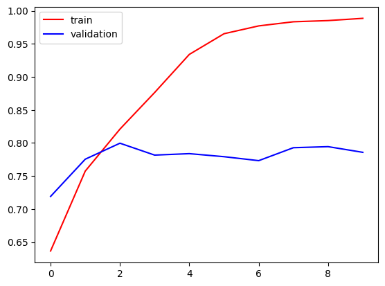
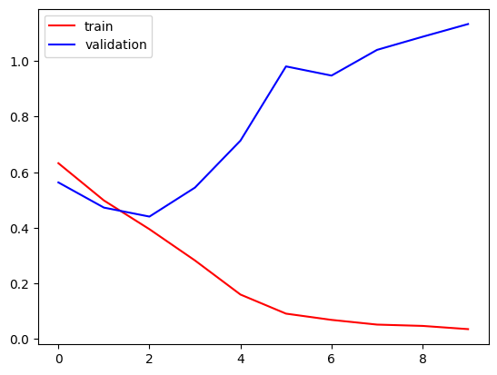
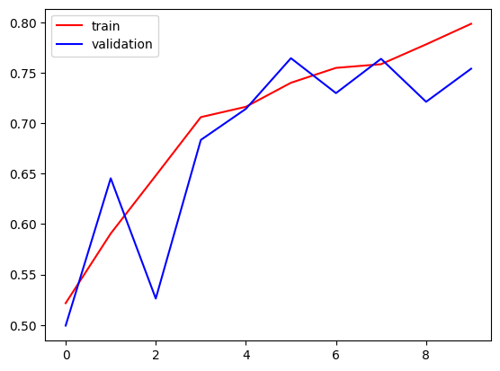
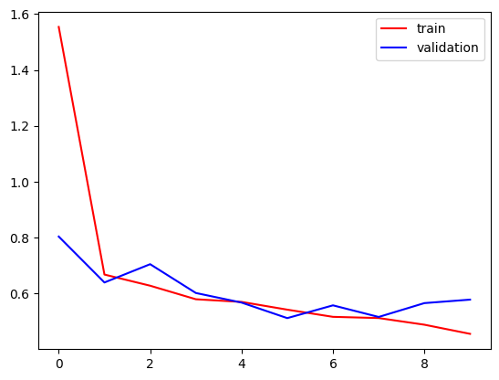
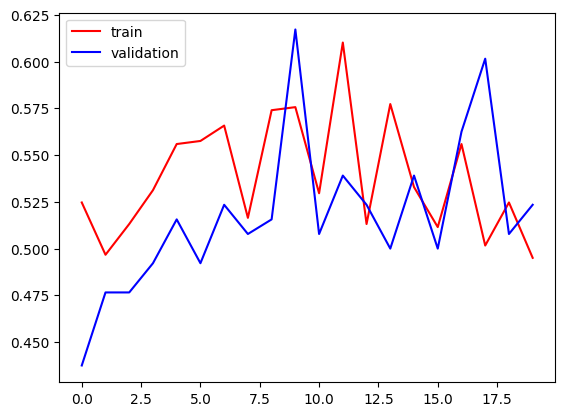
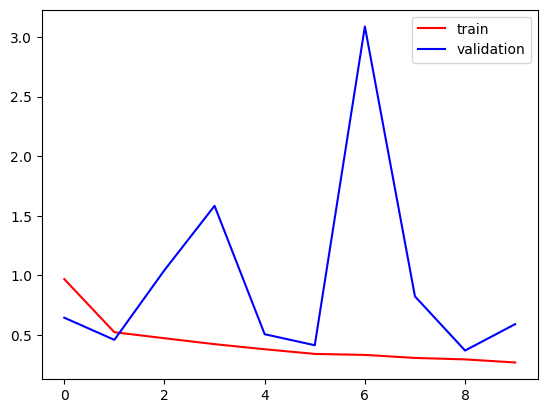
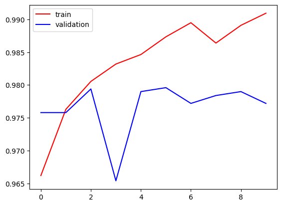
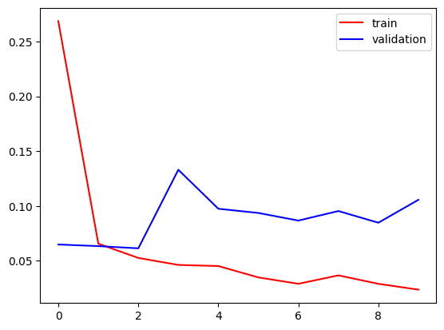
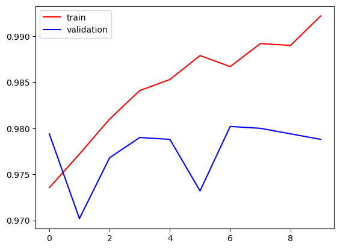
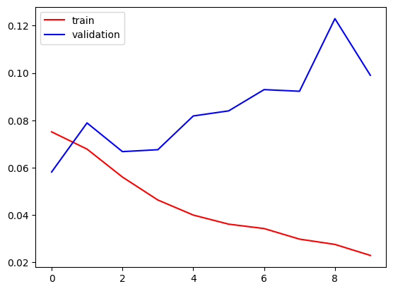

# Cat-Dog Classifier Notebooks

This repository contains a series of Jupyter notebooks demonstrating progressive techniques to build a Deep Learning image classifier for the Kaggle Dogs vs. Cats dataset. We start from a basic Convolutional Neural Network (CNN) and incrementally introduce advanced techniques to improve model generalization and performance.

All notebooks solve a binary classification problem (predicting whether an image contains a cat or a dog) using Keras and TensorFlow. 

## 📦 Dataset Information
The project uses the [Kaggle Dogs vs. Cats Dataset](https://www.kaggle.com/datasets/salader/dogsvscats). 
- **Training Set**: 20,000 images (class-balanced)
- **Test/Validation Set**: 5,000 images (class-balanced)

## 🛠️ Tech Stack & Requirements
- Python 3.x
- TensorFlow / Keras 
- Jupyter Notebook
- Matplotlib (for training curves)

## 📓 Notebooks Overview

### 1. `Basic_CNN_catdog.ipynb` (Basic CNN Implementation)
**Architecture**: 
- A standard CNN with 3 pairs of `Conv2D` (32, 64, 128 filters) and `MaxPooling2D` layers.
- A fully connected header consisting of two `Dense` layers (128 and 64 units) and a final `Sigmoid` output layer.
- Total parameters: ~14.8M.

**Results & Analysis**:
- **Training Accuracy**: ~98.7%
- **Validation Accuracy**: ~78.5%
- **Conclusion**: The model suffers from severe **overfitting**. While it learns the training data extremely well, it fails to generalize to the unseen validation set, which is a common issue for basic deep CNNs trained on limited datasets without regularization.

**Training Curves**:

  
  

---

### 2. `Basic_CNN_catdog_BD.ipynb` (CNN + Batch Normalization & Dropout)
**Architecture Variations**: 
- Based on the previous model, this architecture introduces regularization techniques to combat the overfitting problem. 
- `BatchNormalization()` layers were added immediately after every `Conv2D` layer.
- `Dropout(0.1)` layers were added after each fully connected `Dense` layer.

**Results & Analysis**:
- **Training Accuracy**: ~79.1%
- **Validation Accuracy**: ~75.4%
- **Conclusion**: The severe overfitting is largely mitigated, as the gap between training and validation accuracy is significantly reduced. However, the overall accuracy of the model dropped, suggesting the regularization may have been slightly too aggressive or the model is learning slower under these constraints.

**Training Curves**:

  
  

---

### 3. `Basic_CNN_catdog_BDAUG.ipynb` (CNN + BN + Dropout + Data Augmentation)
**Architecture & Data Variations**: 
- The architectural topology identical to the previous notebook (BN + Dropout).
- Uses an `ImageDataGenerator` during training to artificially expand the dataset via **Data Augmentation** techniques: shearing (0.2), zooming (0.2), and horizontal flipping.

**Results & Analysis**:
- **Training Accuracy**: ~85.4% after 11 epochs
- **Validation Accuracy**: ~84.8%
- **Conclusion**: Adding Data Augmentation proved highly effective. It completely closed the gap between training and validation metrics and improved the absolute generalization performance considerably (from ~75% to ~85%) compared to the basic regularized model.

**Training Curves**:

  
  

---

### 4. `catdog_TL_FE.ipynb` (Transfer Learning using Feature Extraction)
**Architecture**: 
- Instead of training convolutions from scratch, this notebook leverages powerful pre-trained network bases as frozen feature extractors, routing their outputs into a custom `Dense(256)` -> `Dropout(0.2)` -> `Dense(1)` classifier head.
- Explores two distinct pre-trained architectures: 
  1. **Xception Base**
  2. **VGG16 Base**

**Results & Analysis**:
- **Model 1 (Xception)**: Training Accuracy: ~99.08% | Validation Accuracy: ~97.72%

  **Xception Training Curves**:
  
  

    
    
  

- **Model 2 (VGG16)**: Training Accuracy: ~99.24% | Validation Accuracy: ~97.88%

  **VGG16 Training Curves**:

  

    
    
  

- **Conclusion**: Transfer learning dramatically outperformed all custom-built networks. By utilizing features learned from massive datasets (like ImageNet), both Xception and VGG16 models achieved near-perfect validation accuracy (~98%) with rapid convergence and minimum tuning.

## 🎯 Summary

Through these steps, the project clearly illustrates the trajectory of improving image classifiers:
1. Building a naive model to establish a baseline.
2. Observing overfitting and reacting with structural regularization (Batch Norm and Dropout).
3. Improving domain variation and generalization visually through Data Augmentation.
4. Capitalizing on state-of-the-art weights via Transfer Learning for top-tier results.

## 🚀 Future Work
- Implement Grad-CAM to visualize which parts of the image (cats/dogs) the CNN focuses on when making predictions.
- Deploy the optimal VGG16/Xception model as a simple web app, for users to upload and classify their own images.

## License 

Licensed under the MIT License — see the `LICENSE` file for details.
